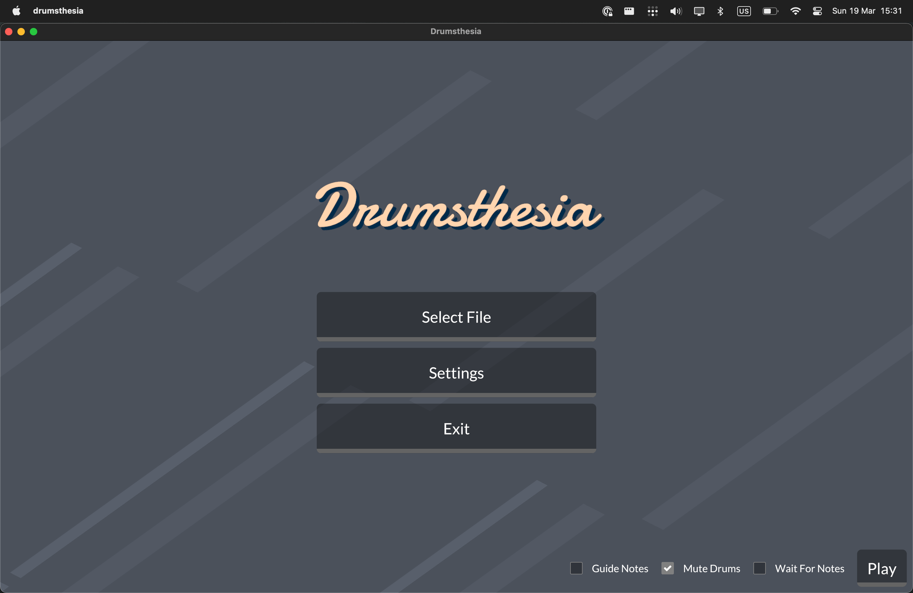
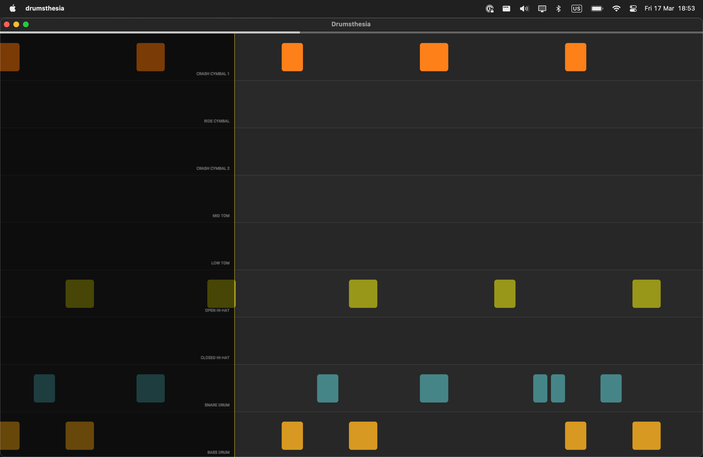
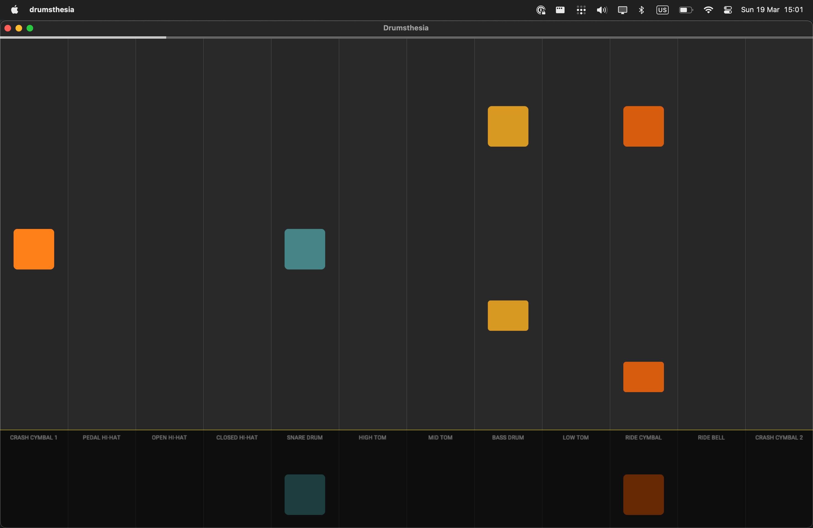

# Drumsthesia - Rock out on your electronic drum kit!

Drumsthesia is the perfect tool for begginer drummers who want to take their skills to the next level. With Drumsthesia, you can play along with your favorite songs by loading MIDI files and seeing exactly what notes to play on the screen. Our built-in synthesizer brings your beats to life, or you can output the MIDI signals to your favorite DAW (Reaper, GarageBand, Ableton) and play with your favorite plugins.

**Demo:** [Check out the demo video on YouTube!](https://youtu.be/cx1214efD6o)

**Download:** [Get the latest release on our Releases Page](https://github.com/rwtnb/Drumsthesia/releases)

Drumsthesia is available for MacOS, Linux (untested), and Windows (untested). 
**PS:** If you're downloading the Linux or Windows binaries, you'll have to also download the [SoundFont](https://github.com/rwtnb/Drumsthesia/raw/main/Arachno%20SoundFont%20-%20Version%201.0.sf2) file for the synthesizer.

## Features

**Metronome:**
A metronome is the perfect tool to help you keep in time. You'll always be on the beat.

**Wait For Notes:**
Drumsthesia automatically pauses the song until you've hit the expected notes. This allows you to learn at your own pace and master each section before moving on.

**Sound Output:**
Drumsthesia includes a powerful [built-in SoundFont2 synthesizer](https://github.com/PolyMeilex/OxiSynth), providing high-quality sound for your drum practice. You can also output MIDI events to your DAW(Reaper, GarageBand, Ableton...) or other MIDI devices for an even more realistic experience.

**Volume Control:**
Control the volume of the drums and music separately, so you can focus on what you need to hear. You can even mute your drum notes or the guide notes to customize your practice experience.

**Controllable Playback Speed:**
Change the playback speed of the song to suit your learning pace. With adjustable speed using up/down arrows, you can slow down the song to learn at your own pace, or speed it up to challenge yourself.

### Screenshots

**Horizontal Layout**

**Vertical Layout**

## How to use

Drumsthesia is incredibly easy to use! Here's a quick guide to get you started:

 - Download a GuitarPro (.gp5) file from the internet, such as from [songsterr.com](https://songsterr.io).
 - Export the file as a MIDI (.mid) file using GuitarPro or MuseScore. This will allow you to open the file in Drumsthesia.
 - Start Drumsthesia and open the MIDI file you just exported. The app will automatically isolate the notes of the drum track for you to play along with.
 - Use the built-in metronome to help you keep in time, and adjust the volume of the drums and music separately to create the perfect practice environment.
 - If you need to customize your practice experience, you can mute your user drum notes or the guide notes, and even adjust the playback speed to your learning pace.
 - Enjoy!

### Keybindings

| Key               |	Function                                                       |
|-------------------|----------------------------------------------------------------|
| Up/Down Arrows    |	Control playback speed                                         |
| Space             |	Play/pause                                                     |
| F	                | Enter fullscreen mode (rock on!)                               |
| S	                | Enter settings screen (customize your Drumsthesia experience!) |
| Enter/Return      | Confirm actions (keep those beats coming!)                     |
| Esc	              | Go back (but why would you want to leave the jam?)             |
| Left/Right arrows	| Rewind or forward the track (holding shift makes it faster)    |

## Contributing

Hey, you're already jammin' with Drumsthesia - why not help us make it even better? We welcome any contributions, big or small, so feel free to pick up an issue or create a new one. Before submitting a pull request, make sure you've thoroughly tested your code (and maybe even played a sick drum solo to celebrate).

### Building from source

 - Clone the repository: `git clone https://github.com/rwtnb/Drumsthesia.git`
 - Navigate to the project directory: `cd Drumsthesia`
 - Build the project: `cargo build --release`
 - Or just run: `cargo run --release`

If you encounter any issues, feel free to create an issue.

## Acknowledgements

Drumsthesia was born from the rockin' inspiration (and source code) of [Neothesia](https://github.com/PolyMeilex/Neothesia), a synthesia-like software for piano players. We've also got to give a shoutout to the [Arachno SoundFont](https://www.arachnosoft.com/main/soundfont.php) project for providing the default soundfont used in Drumsthesia. Keep on rockin', friends!

Also ChatGPT, for writing this awesome README file and the metronome feature for Drumsthesia.
